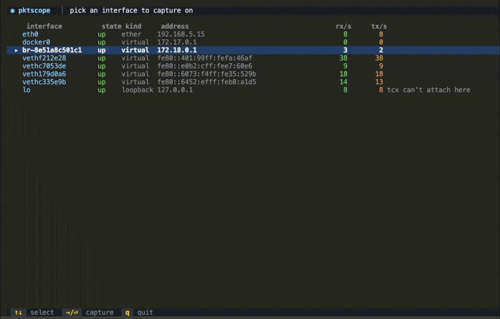
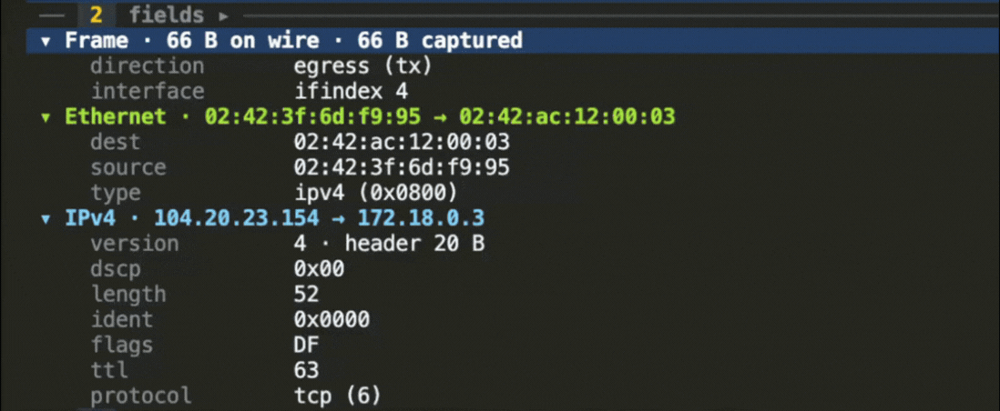
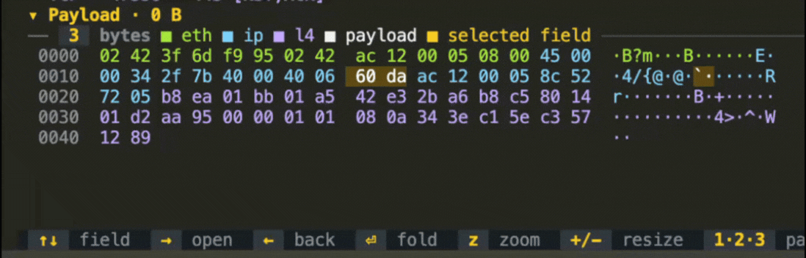

<!-- yeet:user-friendly-title: Analyze live network packets -->
# `pktscope`

> **Wireshark's three panes, in the terminal, on any interface.** Including the raw-IP tunnel devices where tcpdump's ethernet assumptions break.

<p align="center">
  <a href="#requirements"></a>
  <a href="https://yeet.cx/docs/?utm_source=github&utm_medium=readme&utm_campaign=pktscope&utm_content=badge"></a>
  <a href="#capture"></a>
  <a href="#what-the-three-panes-show"></a>
  <a href="#license"></a>
  <a href="https://discord.gg/JxVseaAVAU"></a>
</p>

<p align="center">
  
</p>

**`pktscope` is an eBPF packet analyzer for Linux: it gives you Wireshark's three panes in a terminal, on any interface, including the raw-IP tunnel devices where tcpdump's ethernet assumptions break.**

## Quick start

```sh
curl -fsSL https://yeet.cx | sh    # install yeet, once
yeet run gh:yeet-src/pktscope      # clone, build and run in one step
```

A packet list colored by what the payload turned out to be, a folding protocol tree where every field knows the bytes it decodes, and a hex pane that highlights those exact bytes. Selecting a field moves the highlight in the bytes, so "which two bytes are the checksum" stops being a counting exercise.

The thing you would otherwise reach for is `tcpdump -w` followed by opening the file in Wireshark, or `tshark` to stay in the shell. That means a capture file, a copy off the box, and a context switch to a GUI before you can read a single byte range. `pktscope` reads packets where they are, and it decides where byte zero is per interface rather than assuming an ethernet header that tunnel devices do not have.

> [!TIP]
> **No capture file, no copy off the box, no GUI.** `pktscope` attaches TCX hooks on both ingress and egress, snaps up to 1536 bytes per frame into a 4 MB ring buffer, and decodes in the terminal. Both programs return `TCX_NEXT` on every path, so nothing is dropped, delayed, or rewritten.

## Contents

**Run it** — [Get started](#get-started) · [Have an agent set it up](#have-an-agent-set-it-up) · [Display filter](#display-filter)

**Understand it** — [A 60-second primer](#a-60-second-primer-on-packet-taps) · [Questions this tool answers](#questions-this-tool-answers) · [What the three panes show](#what-the-three-panes-show) · [How it works](#how-it-works) · [What it can't see](#what-it-cant-see)

**Reference** — [Keys and mouse](#keys-and-mouse) · [Layout](#layout) · [Requirements](#requirements) · [FAQ](#faq) · [License](#license)

**Contribute** — [Building from source](#building-from-source) · [Testing across kernels](#testing-across-kernels)

## Get started

```sh
curl -fsSL https://yeet.cx | sh    # install yeet, once
yeet run gh:yeet-src/pktscope      # clone, build and run in one step
```
[Manual install guide](https://yeet.cx/docs/install/manual-installation?utm_source=github&utm_medium=readme&utm_campaign=pktscope) | Linux only

That is the whole install. `yeet run` clones the repo into its own cache, runs `make` to
compile `bin/probe.bpf.o` and bundle the JS, then starts the script; the BPF toolchain is
fetched automatically, so there is no clang, bpftool or `linux-tools` to install first.
`yeet-src` is a trusted source for the runtime, so the build runs without a consent prompt.

Working on the script itself instead of just running it? Clone it and build in place:

```sh
git clone https://github.com/yeet-src/pktscope && cd pktscope
make               # compile bin/probe.bpf.o + bundle the JS (toolchain auto-fetched)
yeet run . --tty   # the interface picker; pick one to start capturing
```

With no flags you land on the interface picker: every device with its kind, addresses, and live rx/tx rates, so you can see which one is actually carrying traffic before you commit to watching it. `lo` is listed but not selectable. Pick a row and the panes fill as packets arrive.

Script flags go **after `--`** so the runtime routes them to the script rather than consuming them itself, which is the most common first-run mistake. Flags belonging to `yeet run` itself (`--tty`, `--quiet`, `--watch`, and so on) go *before* the `--`.

| flag | default | meaning |
| --- | --- | --- |
| `--iface=<name\|index>` | picker | skip the picker and capture immediately. Accepts a comma-separated list to watch several interfaces at once, which is how you see both sides of a bridge |
| `--port=<n>` | any | in-kernel port filter, matched against either endpoint. Non-IP frames like ARP cannot match a port, so this drops them |
| `--proto=<tcp\|udp>` | any | in-kernel L4 filter. Also drops non-IP frames |

```sh
R=gh:yeet-src/pktscope
yeet run $R --tty -- --iface eth0                    # one interface, everything on it
yeet run $R --tty -- --iface eth0,br-8e51a8c5 --proto tcp
yeet run $R --tty -- --iface tunl0                   # a raw-IP tunnel device
```

(From a clone, `.` replaces `gh:yeet-src/pktscope` in any of these.)

Runs until `q` or `Ctrl-C`. Resize the terminal and every pane reflows. It needs a real terminal and mouse reporting, so don't pipe or redirect it.

## Have an agent set it up

Paste this into Claude Code or any agent with shell access:

```
Clone https://github.com/yeet-src/pktscope and work in it.
Read AGENTS.md first, then:

1. Install yeet if it isn't present: curl -fsSL https://yeet.cx | sh
2. Run `make` and confirm bin/probe.bpf.o was produced.
3. Confirm the tap passes the verifier on this kernel:
     sudo make veristat
   Both tap_ingress and tap_egress must report "success".
4. Generate traffic to capture, which is what gives the analyzer
   something to show on an idle box:
     (while :; do curl -s -o /dev/null https://example.com; sleep 1; done) &
5. Run: yeet run . --tty
6. Pick the interface carrying that traffic (the picker's rx/tx columns
   show which one is busy; it is usually eth0). Confirm rows appear with
   decoded Info text, not just "[ACK] seq=...": you want to see
   "TLS Handshake ClientHello · sni=example.com" within a few seconds.
7. Press → to focus the fields pane, walk down with ↓, and confirm the
   hex pane's highlight moves with the selected field. Then q to quit.

"It compiled" is not the same as "it works". An empty packet list and a
broken tap look identical, which is why steps 4 and 6 are not optional.
If the list stays empty: the interface is idle, or you picked a bridge
when the traffic is container-to-container and crosses a veth instead.

Trap: this needs a kernel with BTF (CONFIG_DEBUG_INFO_BTF=y) and TCX
attach support (6.6+). The BPF load fails at step 5, not at step 2, so a
clean `make` tells you nothing about whether it will run. A second trap:
arming --port or --proto silently drops ARP and every other non-IP frame,
because they cannot match a port, so don't debug a "missing ARP" with a
port filter set.
```

Prefer to drive it yourself? [Get started](#get-started) is two commands.

## A 60-second primer on packet taps

The mental model for where `pktscope` sits and what that does and doesn't give you:

**A TC hook, not a socket.** Tools built on `AF_PACKET` ask the kernel for a copy of frames through a socket. `pktscope` runs a BPF program at the traffic-control layer on the interface itself, on both ingress and egress. It sees the frame at the point the kernel hands it to (or takes it from) the device, and it decides in-kernel whether the packet is worth copying at all.

**Which byte is byte zero is a per-interface question.** Every capture tool has to answer it before it can decode anything, and libpcap-era tools answer it once, at compile time, by assuming a 14-byte ethernet header. That holds on `eth0` and breaks on a tunnel. See [where the snap starts](#where-the-snap-starts-and-why-it-matters), which is the reason this exists as its own tool.

**Two filters, in two different places.** The in-kernel scope (`--port`, `--proto`) is checked inside the BPF program before a ring-buffer reservation, so unmatched traffic costs almost nothing and never reaches userspace. The display filter (`/`) runs in userspace over packets you already captured, so it is instant and reversible and can match decoded fields like an SNI. Getting these two confused is the usual reason a capture looks empty.

**Packets, not streams.** Each packet is decoded on its own. There is no reassembly, so a TLS record or an HTTP message split across segments is reported as spanning segments rather than stitched back together. That is the limit everything in [what it can't see](#what-it-cant-see) follows from.

## Questions this tool answers

**How do I capture packets on a `tunl0`, GRE, or WireGuard interface when tcpdump decodes them as garbage?**
That is the case pktscope was built for. Raw-IP devices hand the tap a bare IP packet with no ethernet header, and the tap anchors its copy at the network header for exactly those devices. See [where the snap starts](#where-the-snap-starts-and-why-it-matters).

**How can I inspect east-west traffic between two Docker containers without adding a sidecar or a proxy?**
Attach to the container's veth rather than the bridge. Container-to-container traffic crosses the veth pair directly, so a capture on `br-*` sees egress to the internet but not the traffic between two containers on the same bridge. Resolve the veth from the container's `eth0@ifN` peer index.

**Can pktscope show a packet's protocol tree and hex bytes side by side, the way Wireshark does, without leaving the terminal?**
Yes, and the two panes are linked: selecting a field in the tree highlights the bytes it decodes. See [what the three panes show](#what-the-three-panes-show).

**Why does my capture show TLS but no HTTP, even though the service is serving HTTP?**
Because it is HTTPS. At the TC layer the payload is ciphertext, so the records identify as TLS `ApplicationData` and the plaintext parser sees nothing. pktscope labels those records explicitly instead of leaving you guessing. Reading the plaintext needs a uprobe on `SSL_write`/`SSL_read`, which is a different tool: see [`wssnoop`](https://github.com/yeet-src/wssnoop) for the WebSocket-over-TLS case.

**Is my latency on the wire or inside my server? How do I read the RTT between a TCP SYN and the SYN/ACK in pktscope?**
Every packet carries a kernel timestamp and the list shows relative time, so you can read the gap between a request and its response directly off adjacent rows. What pktscope does not do is compute percentiles or aggregate across connections; for ranked per-endpoint latency reach for [`container-traffic`](https://github.com/yeet-src/container-traffic).

**Can I filter a live packet capture down to TCP payload-carrying or RST/SYN packets without restarting pktscope?**
Yes. The display filter runs in userspace over what you already captured, so `data`, `!ack`, `len>500`, `syn`, and `rst` are instant and reversible. Only `--port` and `--proto` require a restart, because those are compiled into the kernel-side scope.

**When should I use pktscope instead of tcpdump, tshark, or Wireshark?**
Use pktscope when you want to read packets interactively on the box, especially on a tunnel device where the ethernet assumption breaks. Use tcpdump when you want a `.pcap` file, a BPF filter expression, or a capture you will analyze later, since pktscope has no pcap export. Use Wireshark or tshark when you need TCP stream reassembly, decryption with keys, hundreds of dissectors, or a capture longer than the 4000-packet ring holds.

**Is pktscope a replacement for Wireshark?**
No, and it is not trying to be. Wireshark has two decades of dissectors, follows and reassembles TCP streams, decrypts with a key log, and saves your work. pktscope decodes five payload kinds, keeps the last 4000 packets in memory, and writes nothing to disk. What it has instead is that it runs where the traffic is, needs no capture file, and gets the byte-zero question right on tunnel devices.

## Where the snap starts, and why it matters

Every packet capture tool has to answer one question before it can decode anything: which byte is byte zero. Tools built on `AF_PACKET` and libpcap answer it once, at compile time, by assuming a 14-byte ethernet header sits in front of the IP header. On `eth0` that assumption holds. On `tunl0`, `ipip0`, a GRE tunnel, or a WireGuard interface it does not, because those devices hand you a bare IP packet with no link header at all. Point a tool that assumes otherwise at one and it reads the IP version nibble as an ethertype and decodes garbage.

pktscope decides per interface, at attach time. Userspace classifies each device and writes its link-header length into a BPF hash map (`l2map`, ifindex → length); the tap reads that map and anchors its copy at either `BPF_HDR_START_MAC` or `BPF_HDR_START_NET`:

- **Ethernet-framed devices** (physical NICs, veths, bridges, `tap`, `gretap`) capture from the MAC header, so link-level frames like ARP arrive whole and decode fully.
- **Raw-IP devices** (`tunl*`, `ipip`, `sit`, `gre`, `tun`, `wg`, `tailscale`) capture from the network header.

That is the whole trick, and it is the reason this exists as its own tool rather than a tcpdump flag.

## What the three panes show

**The packet list** colors each row by what the payload was identified as. TLS records carry their content type and the SNI out of a ClientHello; HTTP/1 shows its request or status line; HTTP/2 shows the connection preface and frame types; DNS shows the query name and type; ARP shows `who has 10.0.0.7? tell 10.0.0.1`. Columns drop by priority as the terminal narrows.

**The protocol detail tree** folds into Frame, Ethernet, IP, the L4 header, and Payload. Every field carries the byte range it decodes, which is what makes the hex pane useful.

<p align="center">
  
</p>

**The hex pane** colors every byte by the section it belongs to, and highlights the field selected in the tree byte-for-byte. Moving the cursor in the tree moves the highlight in the bytes, so "which two bytes are the checksum" stops being a counting exercise.

<p align="center">
  
</p>

## Display filter

`/` opens a filter. Space-separated terms AND together, `!` negates, and anything unrecognized becomes a substring match over the packet's decoded text and printable payload, so a bare `ClaudeBot` or `10.0.0.7` just works and nothing you type is an error.

```
tls http1 http2 dns text arp     identified kind / frame type
tcp udp icmp                     l4 protocol
port 443  host 10.0.0.1          endpoints (src/dst work too)
sni example.com  ua ClaudeBot    decoded fields
syn rst fin ack  rx tx  data     tcp flags, direction, has-payload
len>500  !ack                    length compare, negation
```

## Keys and mouse

| context | keys |
| --- | --- |
| Picker | `↑↓` select · `⏎`/`→` capture |
| List | `↑↓`/`jk` packet · `→`/`⇥` fields pane · `f` follow tail · `p` pause · `/` filter · `c` clear · `1·2·3` toggle panes · `z` zoom · `+`/`-` resize · `←`/`esc` back · `q` quit |
| Fields | `↑↓` field · `→` open/descend · `←` fold/back · `⏎` toggle fold |
| Mouse | wheel scrolls the pane under the cursor, click selects, dragging a divider resizes |

`←`/`→` are back and forward everywhere: `→` drills in (pick an interface, step into the fields pane, open a folded section) and `←` climbs back out.

## How it works

The tap attaches TCX ingress and egress hooks on the interfaces you choose and streams whole frames, up to 1536 bytes, into a 4 MB ring buffer. It is a passive observer: both programs return `TCX_NEXT` on every path, so nothing is ever dropped, delayed, or rewritten.

### The BPF side

`src/bpf/pktscope.bpf.c` holds both programs, `tap_ingress` and `tap_egress`, which are the same `tap()` function called with a direction flag. Three maps carry the state: `scope` (an array of one `scope_cfg`) is the armed port/proto filter, `l2map` (a hash, ifindex to link-header length) is how userspace tells the program which devices are ethernet-framed, and `events` is the 4 MB ring buffer.

The program reads `l2map` for the current ifindex to pick its anchor (`BPF_HDR_START_MAC` or `BPF_HDR_START_NET`), parses just enough of the IP and L4 headers to fill the fixed fields and apply the in-kernel filter, then reserves a `scope_pkt` and copies the frame. On ethernet framing the ethertype gates the IP parse, so an ARP body cannot masquerade as IPv4.

Two details exist purely to satisfy the verifier and clang. Zeroing the 1536-byte buffer uses an 8-byte-stride loop with a volatile store, because a whole-struct `memset` is too large for clang to expand on the BPF target and the idiom recognizer will otherwise fold the loop back into a `memset` call. And the copy length needs a proven `[1, CAP]` range on the exact register passed to the helper, which takes two `barrier_var` calls and a signed compare; see [testing across kernels](#testing-across-kernels).

### The JS side

`probes/tap.js` is the only BPF-aware module: it loads `bin/probe.bpf.o`, binds the three maps, attaches both hooks to every chosen ifindex, writes the `l2map` entries, subscribes to the ring buffer, and arms the scope last so the ring never fills before a subscriber is listening. It hands userspace plain objects and nothing else.

`probes/capture.js` owns the session. Packets accumulate in a plain array rather than a signal, because a ring-buffer callback that touched a signal would re-render the UI once per packet; a 150 ms timer publishes a `tick` instead. The array is capped at 4000 packets and trims 512 at a time.

`lib/proto.js` is pure dissection, with no BPF and no UI: `classify()` identifies the payload and `buildTree()` turns a packet into Wireshark-style sections. Every field carries the byte range it decodes, which is the whole mechanism behind the linked hex highlight. `lib/filter.js` compiles the display-filter string into a predicate, and `components/` is pure presentation reading signals.

### Why TCX, not AF_PACKET or an XDP program

TCX (the successor to `clsact` tc-BPF) sits at the point where the per-interface snap decision is actually available, and it exists on both ingress and egress, so one attach covers both directions. `AF_PACKET` would mean copying every frame to userspace and filtering there, which is the cost model this avoids. XDP runs earlier, before `skb` allocation, which sounds better and is worse here: it is ingress-only on most drivers, so egress would need a second mechanism, and it has no `skb` to pull linear, which is what makes paged loopback and GSO payloads readable.

## Requirements

> [!IMPORTANT]
> Linux with **BTF** (`CONFIG_DEBUG_INFO_BTF=y`), needed to generate `vmlinux.h` and to load the tap. Default on current Arch, Fedora, Ubuntu, and Debian 12+.
>
> A kernel with **TCX attach support**, which landed in **6.6**. CI verifies the object passes the verifier on 6.1, 6.6 and 6.12, so an older kernel may compile and load it without being able to attach.
>
> The yeet daemon handles the privileged BPF load; `curl -fsSL https://yeet.cx | sh` installs it. `yeet run` itself is unprivileged and never needs `sudo`. `make veristat` is the one exception, because it loads the object directly.
>
> A truecolor terminal with mouse reporting. Wheel scrolling, click-to-select and divider dragging need mouse support; the keyboard covers everything else.

## What it can't see

> [!NOTE]
> `pktscope` is observability, not enforcement. It reads what crosses an interface; it never drops, delays, or rewrites a packet.

- **No TCP stream reassembly.** Each packet is decoded on its own. A TLS record or an HTTP/1 message split across segments is reported as spanning segments rather than stitched back together, and a request whose headers straddle two packets shows only the part in each.
- **HTTPS payloads are ciphertext.** TLS records are identified and their SNI extracted from the ClientHello, but `ApplicationData` contents are unreadable at this layer, by design.
- **HTTP/2 header fields are not decoded.** Frame types, stream ids, and flags are shown; the header block is HPACK-coded and pktscope reports it as such without decompressing it. For gRPC and protobuf message decoding use [`grpcsnoop`](https://github.com/yeet-src/grpcsnoop).
- **Frames are truncated at 1536 bytes.** Enough for a full untagged ethernet MTU frame, but a jumbo frame or a large TSO segment is captured partially. The list shows both wire length and captured length so truncation is always visible.
- **1536 bytes is measured from the first captured byte.** On a raw-IP device that is the IP header, so the effective payload budget differs slightly from an ethernet device.
- **The ring holds 4000 packets.** Past that the oldest 512 are dropped in a batch. There is no disk spill and no pcap export, so a capture you want to keep has to be read while it is on screen.
- **Loopback cannot be captured.** The picker marks `lo` as unselectable with `tcx can't attach here`. Traffic between two processes on the same host is out of reach, which includes a container talking to a host service over `127.0.0.1`.
- **IPv6 extension headers are not walked.** The L4 offset assumes the common no-extension case, and the protocol shown is the first next-header value. A packet carrying a routing or fragment header decodes its L4 fields from the wrong offset.
- **IPv4 fragments are not reassembled.** Fragment flags and offsets are shown; only the first fragment carries a decodable L4 header.
- **DNS decoding is UDP port 53 only.** DNS over TCP, DoT, and DoH are not decoded as DNS. Name compression pointers end the label walk rather than being followed.
- **A port or protocol filter suppresses non-IP frames.** ARP cannot match a port, so arming `--port` or `--proto` drops ARP and other link-level frames from the capture entirely.
- **Single host, single interface set.** No fleet aggregation, no cross-host correlation, no retention. This is a tool you run on the box where the packets are.

## Layout

```
Makefile                build frontend: clang/bpftool + esbuild
build/                  toolchain resolution, BPF rules, kernel-matrix CI
src/main.jsx            entry, composition root: input, layout, mount
src/probes/tap.js       loads bin/probe.bpf.o, arms the scope, streams packets
src/probes/capture.js   capture session state: packet ring + UI signals
src/probes/ifaces.js    interface inventory for the picker (kind, rates, L2)
src/components/*.jsx    pure UI: list, detail tree, hex pane, picker, chrome
src/lib/proto.js        pure dissection: ethernet/ARP/IP/TCP/UDP + payload ID
src/lib/filter.js       display-filter compiler
src/lib/format.js       palette + table/format helpers
src/bpf/pktscope.bpf.c  the TCX tap
```

The JS is layered, and the layering is enforced by convention rather than tooling: `probes/` is the only BPF-aware code and exposes plain signals, `components/` is pure presentation, and `lib/` is pure parsing and formatting. `@/` (source root) and `#/` (project root) are bundle-time aliases esbuild resolves from tsconfig `paths`.

A detail worth knowing if you edit `capture.js`: a ring-buffer callback never touches a signal directly, because that would re-render the UI once per packet. Packets accumulate in a plain array and a 150 ms timer publishes a `tick` instead.

## Building from source

```sh
make            # everything: BPF object + JS bundle
make bpf        # just src/bpf/pktscope.bpf.c -> bin/probe.bpf.o
make bundle     # just src/main.jsx -> src/index.jsx
make veristat   # load the object with veristat on this kernel (needs sudo)
```

`make` drives two compilers that know nothing about each other. clang and bpftool compile the tap into `bin/probe.bpf.o`; esbuild bundles the JSX entry into `src/index.jsx`, leaving `yeet:*` builtins external. The BPF object is never imported, only located at runtime via `import.meta.dirname`, which is why the two halves can be built independently.

## Testing across kernels

`make veristat` loads the object with veristat on your kernel and reports whether each program passes the verifier, plus its instruction count and state count.

A program that loads on your laptop can still be rejected by an older kernel's verifier, which is not a hypothetical here: the tap carries three separate workarounds for pre-6.8 and pre-6.12 verifier behavior around the snap-length clamp, and each was added because a kernel in the matrix rejected the program.

`.github/workflows/kernel-matrix.yml` builds the object once, boots 6.1, 6.6, and 6.12 in VMs via [cilium's little-vm-helper](https://github.com/cilium/little-vm-helper), and fails if any verifier rejects it. Run the same matrix locally on Linux with KVM:

```sh
make veristat-matrix KERNELS="6.6-main bpf-next-main"
```

<details>
<summary>Why the snap length needs three verifier workarounds</summary>

The copy length handed to `bpf_skb_load_bytes_relative` is derived from packet data, so the verifier needs a proven `[1, CAP]` range on the exact register passed to the helper. Three things get in the way, and each needs a separate nudge:

1. **clang elides a provably-dead clamp.** `barrier_var(copy)` makes the value opaque before the bound is applied, so the clamp survives.
2. **Branch refinement can land on the wrong register.** Without the barrier clang fuses the range check into a decremented copy, and the refinement applies to a register other than the call argument.
3. **Pre-6.8 verifiers don't lift `umin` from a `!= 0` branch,** but have always refined `JSGT`. Hence the signed compare `(__s32)copy > 0` rather than `copy != 0`, and a second `barrier_var` so clang doesn't fold the signed compare back into the unsigned form it considers equivalent.

The zeroing of the 1536-byte capture buffer has its own constraint: a whole-struct `memset` is too large for clang to expand on the BPF target, so the fixed header is zeroed with the builtin and the buffer with an 8-byte-stride loop, with a volatile store to stop clang's idiom recognizer folding the loop back into a `memset` call.

</details>

## FAQ

**How do I capture traffic between two Docker containers when a `br-*` bridge capture shows nothing?**
Attach to the container's veth instead of the bridge. Two containers on the same Docker network talk veth-to-veth and never traverse `br-*`, so a bridge capture sees egress to the internet and none of the east-west traffic. Find the veth by reading the peer index out of the container's `eth0@ifN`:

```sh
PID=$(docker inspect -f '{{.State.Pid}}' my-container)
nsenter -t $PID -n ip -o link show eth0     # eth0@if13 -> host side is vethXXXX@if13
yeet run . --tty -- --iface vethc7053de
```

**How do I keep ARP and other non-IP frames when narrowing a pktscope capture to one port?**
Don't arm `--port` or `--proto`; narrow with the display filter instead. ARP is not an IP packet, so it can never match a port, and the in-kernel filter drops every non-IP frame while either flag is set. Capture unfiltered and type `/ arp` in the UI, which runs in userspace and keeps link-level frames. This is the one filter difference that silently changes what exists rather than what is shown.

**How do I run pktscope on a `tunl0`, `ipip`, GRE, or WireGuard interface?**
Pass it like any other device: `yeet run . --tty -- --iface tunl0`. No flag tells pktscope the device is raw-IP, because it classifies each interface at attach time and anchors the snap at the network header for tunnels and at the MAC header for ethernet-framed devices. That is the case pktscope exists for, so it needs no special invocation. See [where the snap starts](#where-the-snap-starts-and-why-it-matters).

**How do I find which bytes in the hex pane a decoded protocol field came from?**
Press `→` to focus the fields pane and walk down with `↑↓`. Every field in the protocol tree carries the byte range it decodes, and the hex pane highlights exactly those bytes as the cursor moves. So reading the TCP checksum's two bytes, or the 32 bytes of a TLS ClientHello random, is a matter of selecting the field rather than counting offsets.

**How do I capture several interfaces at once with `--iface`, and tell ingress from egress?**
Pass `--iface` a comma-separated list: `yeet run . --tty -- --iface eth0,br-8e51a8c501c1`. Both TCX hooks attach to every ifindex in the list, and the packet list interleaves them in timestamp order with each row's direction marked `▼` for ingress and `▲` for egress.

**How do I freeze the pktscope packet list with `f` or `p` to read one packet?**
`f` toggles follow-tail and `p` pauses the capture. `f` leaves the tap running and stops the selection jumping to the newest packet; `p` stops accepting packets entirely. Either way, the numbers keep climbing while the list shrinks once the 4000-packet ring starts trimming 512 at a time, which is the ring recycling rather than packets being lost.

**How do I run pktscope with the output piped to a file or in CI?**
You can't. pktscope is a mouse-driven TUI with no headless mode and no `--json`, so redirecting stdout produces `ReferenceError: tty is not defined` rather than a capture. Use tcpdump for a scriptable or file-based capture; pktscope is for reading packets interactively on the box.

## License

Dual BSD/GPL.

---

Built with [yeet](https://yeet.cx/docs/?utm_source=github&utm_medium=readme&utm_campaign=pktscope&utm_content=footer), a JS runtime for writing eBPF programs on Linux machines. Join us on [discord](https://discord.gg/JxVseaAVAU).
